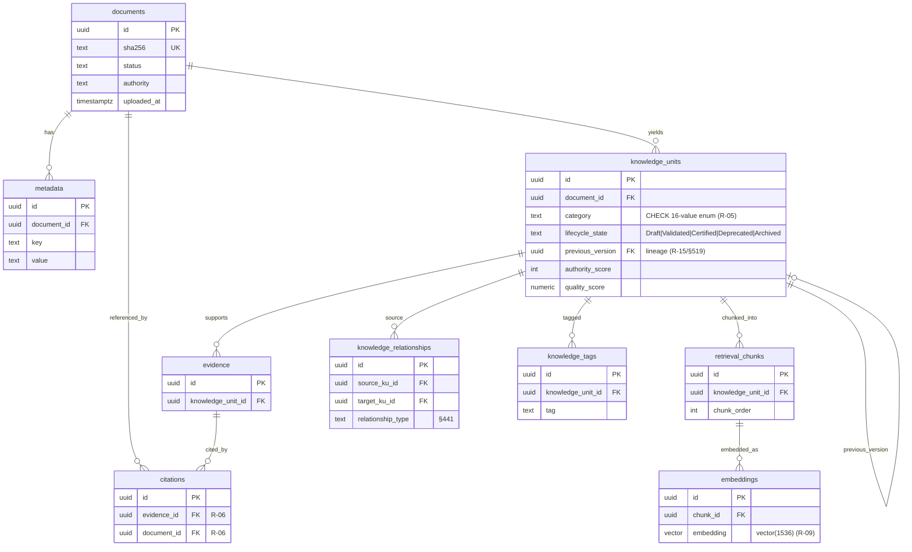

# CRIE Entity-Relationship Diagram

Referential model (§233). `-->` = foreign key (child references parent);
`ON DELETE CASCADE` prevents orphans.

Chain (§233): documents → knowledge_units → evidence → citations;
knowledge_units → retrieval_chunks → embeddings.

Supporting schemas (`configuration`, `monitoring`, `audit`) are documented in
`docs/architecture/Database_Schema.md`; they are not part of the repository FK
chain (monitoring/audit are decoupled per §229/§230).
